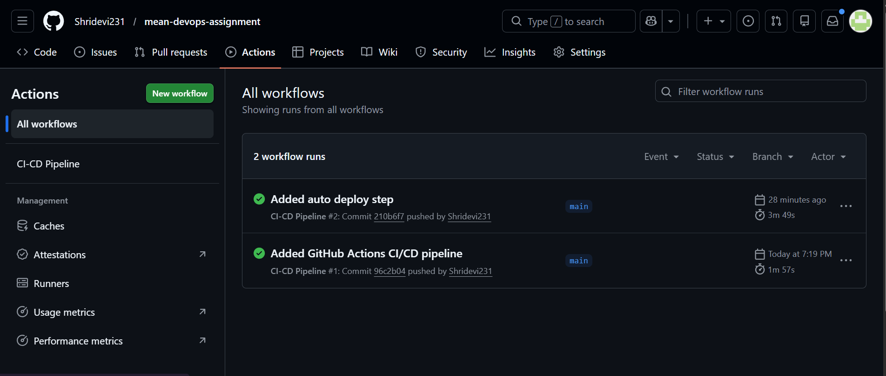
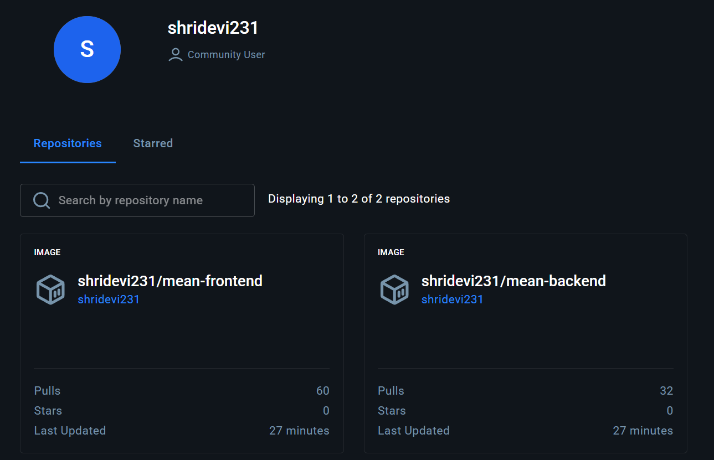
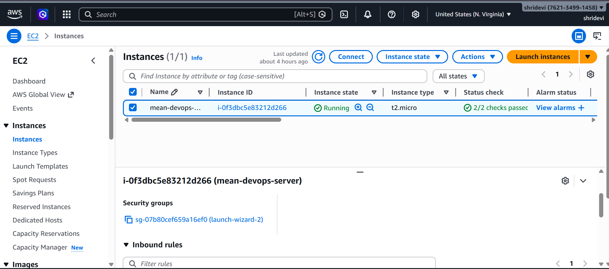
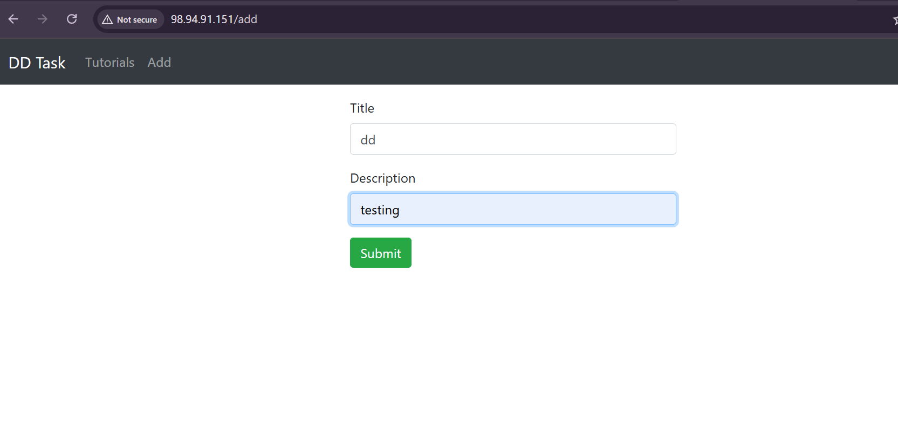
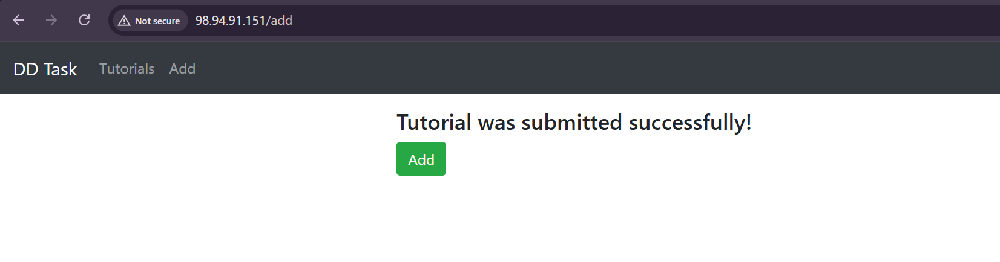
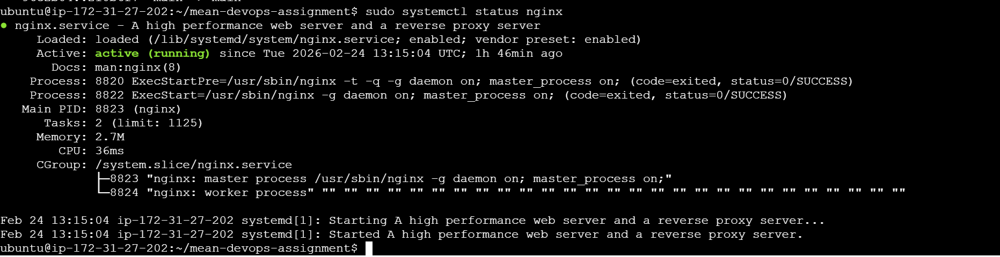

# MEAN Stack CRUD Application - DevOps Deployment

## 📌 Project Overview

This project demonstrates the containerization and deployment of a full-stack MEAN (MongoDB, Express, Angular, Node.js) CRUD application using Docker, Docker Compose, Nginx reverse proxy, AWS EC2, and GitHub Actions CI/CD pipeline.

---

## 🏗 Architecture

- Frontend: Angular 15
- Backend: Node.js + Express
- Database: MongoDB (Docker container)
- Reverse Proxy: Nginx
- Containerization: Docker & Docker Compose
- Cloud: AWS EC2 (Ubuntu)
- CI/CD: GitHub Actions
- Image Registry: Docker Hub

---

## 🟢 STEP 1 – Repository Setup
### 1️⃣ Extract Project
2️⃣ Initialize Git
``` bash
git init
git remote add origin https://github.com/<your-username>/mean-devops-assignment.git
git add .
git commit -m "Initial commit"
git push -u origin main
```
---

## 🟢 STEP 2 – Dockerize Backend
Created backend/Dockerfile:
``` dockerfile
FROM node:18-alpine
WORKDIR /app
COPY package*.json ./
RUN npm install
COPY . .
EXPOSE 8080
CMD ["node", "server.js"]
```
---

## 🟢 STEP 3 – Dockerize Frontend
Created frontend/Dockerfile:
``` dockerfile
FROM node:18-alpine
WORKDIR /app
COPY package*.json ./
RUN npm install
COPY . .
RUN npm run build
RUN npm install -g serve
EXPOSE 8081
CMD ["serve", "-s", "dist/angular-15-crud", "-l", "8081"]
```
---

## 🟢 STEP 4 – AWS EC2 Setup
1️⃣ Launch Ubuntu EC2 Instance
Open ports:
* 22 (SSH)
* 80 (HTTP/Nginx)
* 8080 (Backend)
* 8081 (Frontend)

2️⃣ Connect to Server: ssh -i key.pem ubuntu@PUBLIC_IP

---

## 🟢 STEP 5 – Install Docker on EC2
``` bash
sudo apt update
sudo apt install docker.io -y
sudo systemctl start docker
sudo systemctl enable docker
sudo usermod -aG docker ubuntu
sudo apt install docker-compose -y
sudo chmod +x /usr/local/bin/docker-compose
```
Verify:
``` bash
docker --version
docker-compose --version
```
---

## 🟢 STEP 6 – Clone Repository on EC2
git clone https://github.com/<your-username>/mean-devops-assignment.git
cd mean-devops-assignment

---

## 🟢 STEP 7 – Create Docker Compose

Created docker-compose.yml:
``` yml
version: "3.8"

services:

  mongo:
    image: mongo:6
    container_name: mongo_db
    restart: always
    ports:
      - "27017:27017"
    volumes:
      - mongo_data:/data/db

  backend:
    build: ./backend
    container_name: backend_app
    restart: always
    ports:
      - "8080:8080"
    depends_on:
      - mongo

  frontend:
    build: ./frontend
    container_name: frontend_app
    restart: always
    ports:
      - "8081:8081"
    depends_on:
      - backend

volumes:
  mongo_data:
```
### Fixed MongoDB Connection
Navigate to backend/app/config/db.config.js and change 
``` javascript
module.exports = {
  url: "mongodb://mongo:27017/dd_db"
};
```
Now run:
``` bash
sudo docker-compose up --build -d
sude docker ps
```
### We must change the frontend API URL to your AWS public IP.
Navigate to frontend/src/app/services/tutorial.service.ts and change from ocal host to public ip
``` bash
http://98.94.91.151:8080/api/tutorials
```
### Adding CORS Middleware
``` bash
const cors = require("cors");
const app = express();
```
Open:

http://YOUR_PUBLIC_IP:8081

---

## 🟢 STEP 8 - Pushing Docker images to your Docker Hub account.
```bash
docker login
docker images
```
Tag images
``` bash
docker tag mean-devops-assignment-backend:latest shridevi231/mean-backend:latest
docker tag mean-devops-assignment-frontend:latest shridevi231/mean-frontend:latest
```
Pushing images
```bash
docker push shridevi231/mean-backend:latest
docker push shridevi231/mean-frontend:latest
```
Changes in docker-compose
in backend:
  backend:
    image: shridevi231/mean-backend:latest
in frontend
    frontend:
    image: shridevi231/mean-frontend:latest
### so updated docker-compose.yml:
``` yml
version: "3.8"

services:

  mongo:
    image: shridevi231/mean-backend:latest
    container_name: mongo_db
    restart: always
    ports:
      - "27017:27017"
    volumes:
      - mongo_data:/data/db

  backend:
    image: shridevi231/mean-frontend:latest
    container_name: backend_app
    restart: always
    ports:
      - "8080:8080"
    depends_on:
      - mongo

  frontend:
    build: ./frontend
    container_name: frontend_app
    restart: always
    ports:
      - "8081:8081"
    depends_on:
      - backend

volumes:
  mongo_data:
```
---

## 🟢 STEP 9 -Nginx Reverse Proxy
install and start Nginx
``` bash
sudo apt install nginx -y
sudo systemctl start nginx
sudo systemctl enable nginx
```
Edited Config:
sudo nano /etc/nginx/sites-available/default
Added:
```nginx
server {
    listen 80;
    server_name _;

    location / {
        proxy_pass http://localhost:8081;
        proxy_http_version 1.1;
        proxy_set_header Upgrade $http_upgrade;
        proxy_set_header Connection 'upgrade';
        proxy_set_header Host $host;
        proxy_cache_bypass $http_upgrade;
    }

    location /api {
        proxy_pass http://localhost:8080;
        proxy_http_version 1.1;
        proxy_set_header Host $host;
    }
}
```
Restart Nginx:
sudo systemctl restart nginx
Application now accessible via: http://PUBLIC_IP

---

## 🟢 STEP 10 -CI/CD configuration and execution
```yml
name: CI-CD Pipeline

on:
  push:
    branches:
      - main

jobs:
  build-and-push:
    runs-on: ubuntu-latest

    steps:
      - name: Checkout Code
        uses: actions/checkout@v3

      - name: Login to Docker Hub
        uses: docker/login-action@v2
        with:
          username: ${{ secrets.DOCKER_USERNAME }}
          password: ${{ secrets.DOCKER_PASSWORD }}

      - name: Build Backend Image
        run: docker build -t shridevi231/mean-backend:latest ./backend

      - name: Build Frontend Image
        run: docker build -t shridevi231/mean-frontend:latest ./frontend

      - name: Push Backend
        run: docker push shridevi231/mean-backend:latest

      - name: Push Frontend
        run: docker push shridevi231/mean-frontend:latest
```
### Add github secrets for docker

---

## 🟢 STEP 11 -Automatically pull latest images and restart containers on the VM
Generate SSH key:
``` bash
ssh-keygen -t rsa -b 4096
```
Updated deploy.yml To Auto Deploy
```yml
       - name: Deploy to VM
        uses: appleboy/ssh-action@v0.1.10
        with:
          host: YOUR_PUBLIC_IP
          username: ubuntu
          key: ${{ secrets.VM_SSH_KEY }}
          script: |
            cd mean-devops-assignment
            docker-compose pull
            docker-compose up -d
```
Copy Public Key
``` bash
cat ~/.ssh/id_rsa.pub
```
Add Public Key to authorized_keys
``` bash
nano ~/.ssh/authorized_keys
```
Add the private key to GitHub Secrets.

---

## 🎯 FINAL RESULT

Application accessible via port 80


## 📸 Screenshots

### CI/CD Pipeline Success


### Docker Hub Repositories


### EC2 Instance Running


### Application Working on Port 80




### Nginx Configuration


  


